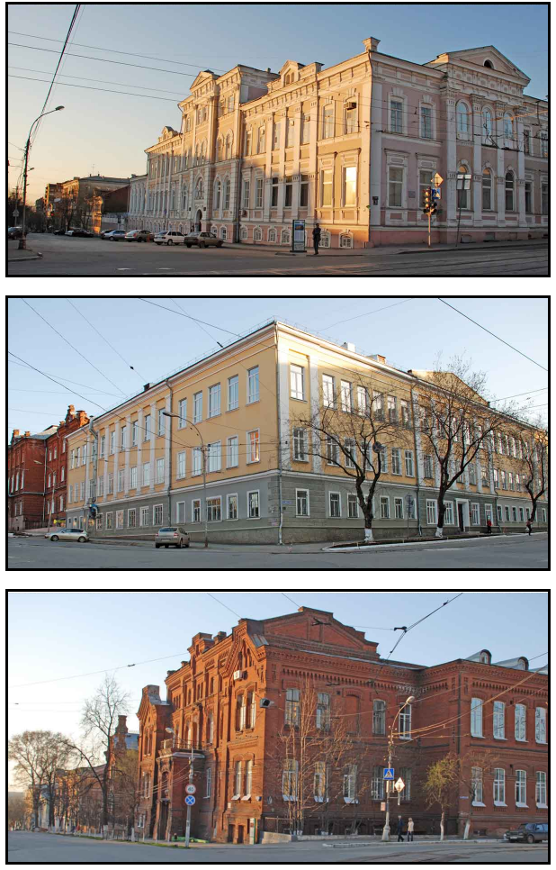
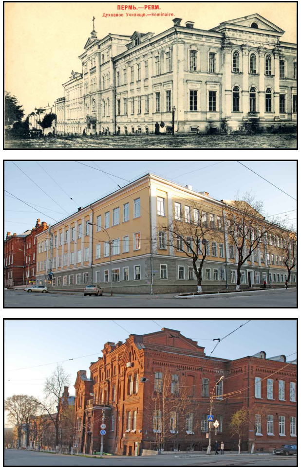
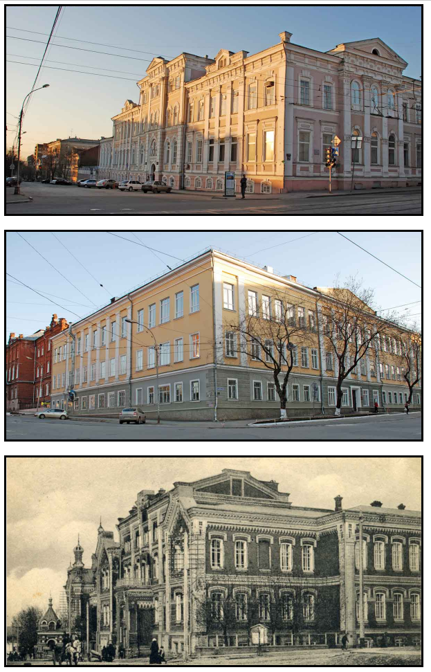
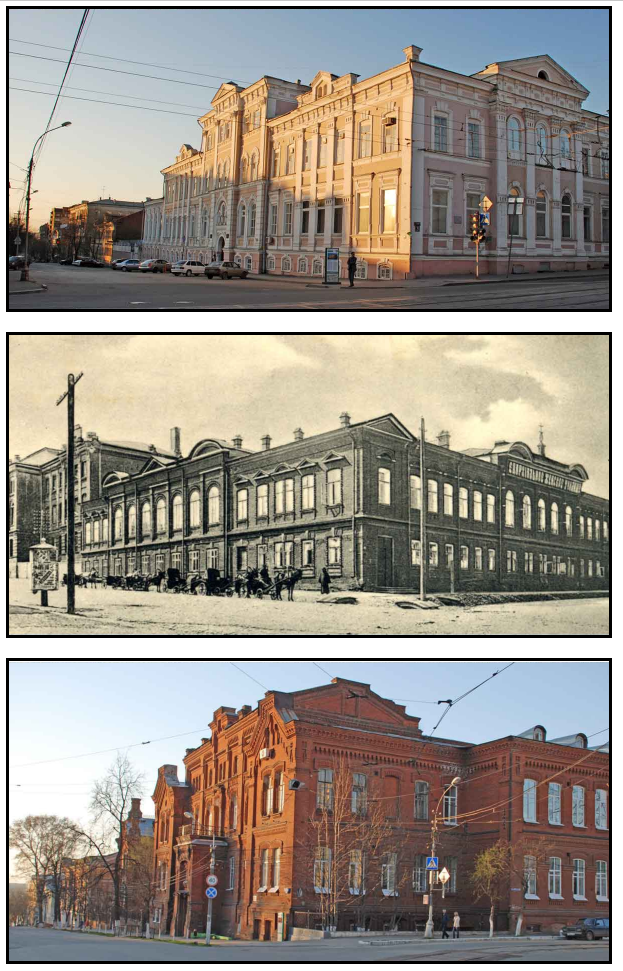

Решение домашнего задания (8 неделя).

Задача: Вывести карточки с фотографиями г.Перми. При наведении на фото карточка переворачивается и на обороте появляется более раннее фото.

Алгоритм решения:

1. Создал 3 карточки. Изображения сделал в виде фона.
2. На всевдокласс :hover задал второй вариант изображения. Это нужно для фиксации изображение после переворота.
3. Создал анимацию с тремя стадиями вращения по оси Y 0% - 0градусов, 50% - 90градусов, 100% - 180градусов.
4. Для плавности переключения изображения добавил свойство transition.

P.S. Для того чтобы второе фото не было перевернуто - я его перевернул заранее.

[20220725_162241_simplescreenrecorder-2022-07-25_16.21.23.mkv](assets/20220725_162241_simplescreenrecorder-2022-07-25_16.21.23.mkv)

